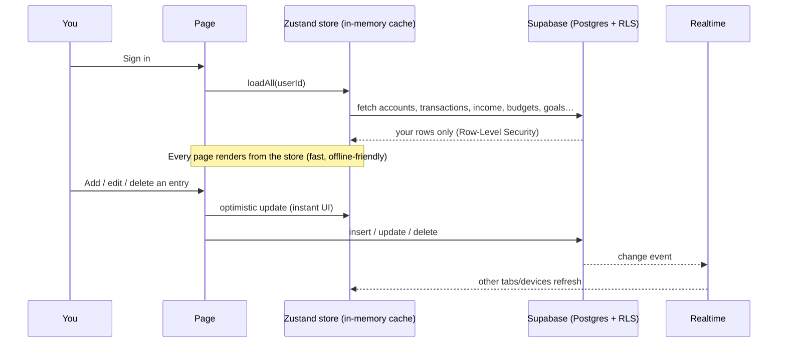
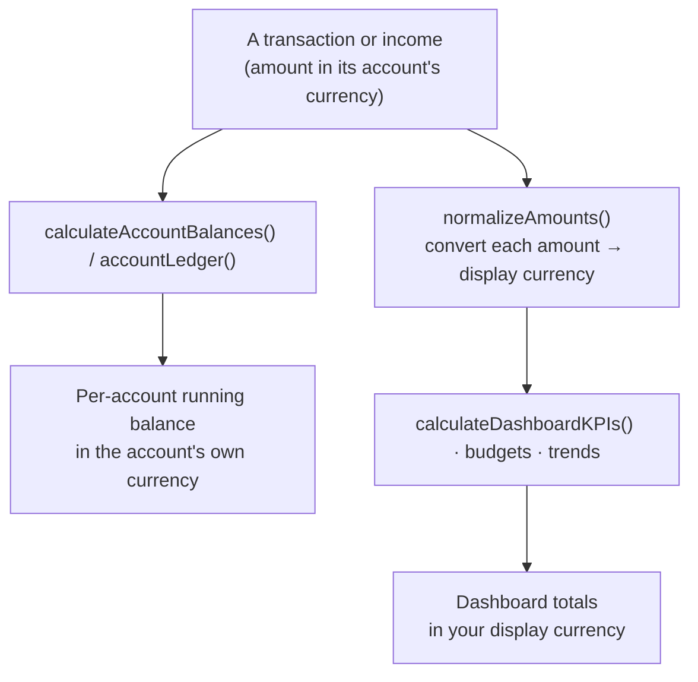

<div align="center">

# 💸 Money Control System

### Your money, fully understood — a multi‑currency personal‑finance app with a built‑in AI assistant.

Track income, spending, credit cards, savings goals and recurring bills — with **bank‑style running balances**, **per‑account multi‑currency**, **real‑time sync**, an **AI Finance Bot**, and an installable **mobile app (PWA)**.


</div>

---

## 📖 In plain English

Think of this app as **your own private bank dashboard**.

- You create **Accounts** — your bank, cash wallet, credit cards, a savings pot, an investment (SIP) account, even a family member's money.
- You log **money in** (salary, refunds) and **money out** (spending, bills, transfers, card payments).
- The app keeps a **running balance for every account** — exactly like a bank statement — so you always know how much you really have and *how you got there*.
- It then turns all that into a colourful **Dashboard** (net worth, what's safe to spend, savings rate), **Budgets** that warn you *before* you overspend, **Goals** that tell you if you can afford that laptop yet, and **Reports**.
- A friendly **🤖 Finance Bot** can answer questions about your own money in plain language ("how much did I spend last Sunday?", "can I afford a ₹1.5L bike?").

Everything lives in **your own** private database. It works on your **phone**, in **light or dark mode**, and even **offline** (it syncs when you reconnect).

---

## 🧭 A 2‑minute tour — with real numbers

Here's the whole app in one story. Say you start fresh:

| # | What you do | Where | Effect on balances |
|---|---|---|---|
| 1 | Set opening balance **₹10,000** on **My SBI** | Add Transaction → *Initial Balance* | SBI = **₹10,000** |
| 2 | Salary **₹50,000** lands in SBI | Income page | SBI = **₹60,000** |
| 3 | Pay **₹1,415** for internet | Add Transaction → *Expense* | SBI = **₹58,585** |
| 4 | Move **₹15,000** to your **SIP** | *Saving* (SBI → SIP) | SBI = **₹43,585**, SIP = **₹15,000** |
| 5 | Move **₹26,981** to **Savings** | *Transfer* (SBI → Savings) | SBI = **₹16,604**, Savings = **₹26,981** |
| 6 | Pay **₹3,576** Axis credit‑card bill | *Credit‑Card Payment* (SBI → Axis CC) | SBI = **₹13,028**, Axis CC owed = **₹3,576** |

Now the app shows you:

- **Account balances** → SBI ₹13,028 · Savings ₹26,981 · SIP ₹15,000 · Axis CC −₹3,576 owed.
- **Net worth** = cash + savings + investments − card debt = `13,028 + 26,981 + 15,000 − 3,576` = **₹51,433**.
- The **Transactions** list shows each line above (the **salary appears as a green `+₹50,000` row**), and every row prints the **balance *after* it** — so you can trace SBI from ₹10,000 all the way down to ₹13,028, just like a passbook.
- **Budgets** track your spending categories; **Goals** tell you a ₹1,00,000 laptop is affordable now but a ₹16,00,000 car is not yet.

> 💡 **Why a balance sometimes "jumps up":** income (like that ₹50,000 salary) is money *in*, so it raises the balance. Income shows on the **Income** page **and** as a green row in **Transactions**, so the running balance always reconciles top‑to‑bottom.

---

## 🧱 Core concepts (the building blocks)

### Accounts
Each account has its **own currency** and a **type** that gives it a colour across the app:

| Type | Colour | Examples |
|---|---|---|
| 🟢 Cash / Bank | emerald | My SBI, Cash wallet |
| 🔵 Savings | blue | Savings pot |
| 🟣 Investment | violet | SIP, mutual funds |
| 🟡 Family | amber | A parent's money you track |
| 🔴 Credit card | rose | Axis CC, ICICI CC (shows *Outstanding* owed) |

Click any account to open its **Statement** (full running‑balance ledger) or **Quick Add** an entry to it.

### The 7 transaction types — and exactly what each does

This is the heart of the app. Every entry adjusts balances in a predictable, bank‑correct way:

| Type | "From" account | "To" account | Use it for |
|---|---|---|---|
| **Expense** | − amount  *(credit card: **+** what you owe)* | — | Buying things, bills |
| **Income** *(on the Income page)* | — | **+** amount | Salary, refunds, rent received |
| **Transfer** | − amount | **+** amount | Moving cash between your own accounts |
| **Saving** | − amount | **+** amount (savings/investment) | Putting money aside / investing |
| **Credit‑Card Payment** | − amount (bank) | − amount owed (card) | Paying your card bill (bank ↓, debt ↓) |
| **Initial Balance** | — | sets the starting amount | The opening balance of a normal account |
| **Initial CC Outstanding** | + amount owed (card) | — | The balance you already owe on a card |
| **Adjustment** | − amount | **+** amount | Manual correction to fix a balance |

> Credit cards are handled correctly: **spending raises** what you owe, **paying lowers** it — and a paid‑off card shows **₹0**, never a weird negative.

### Income vs Recurring Income vs Fixed Expenses
- **Income** — money coming in, logged on the Income page (also shown in Transactions).
- **Recurring Income** — a *template* (e.g. "Salary on the 1st") that **auto‑creates** an income entry each month.
- **Fixed Expenses** — templates for rent, EMIs, subscriptions that **auto‑post** each month on their due day.

Both auto‑post **idempotently** (they can never create a duplicate) and back‑fill any months you missed.

### Budgets, Goals, Reports & Alerts
- **Budgets** — set a monthly limit per category; the app paces it ("allowed till today") and forecasts your **projected month‑end**, flagging *Over / On‑track*.
- **Goals** — set a target (e.g. a ₹1L laptop); it tells you if you can **afford it now**, how much is allocated, and a **timeline** to the target date.
- **Reports** — Monthly / Yearly / Custom range, with category charts, closing balances and CSV export.
- **Alerts** — overspending, low "safe‑to‑spend", high card debt, due bills — grouped by severity, snooze‑able.

---

## 🚀 Feature highlights

### 💰 Accounts & transactions
- **Per‑account currency** (INR, THB, USD…) — each account holds its own; balances show in that native currency.
- **7 transaction types** with correct accounting (see table above), including proper **credit‑card** behaviour and **cross‑currency transfers**.
- **Account Statement** — a running‑balance ledger (oldest → newest, with the balance after every entry) so you can verify *exactly* how today's number was reached. Opens as a **centered pop‑up**.
- **"Balance after" everywhere** — every transaction, income and recurring row shows the affected account's resulting balance, passbook‑style.
- **Income shown in Transactions** — money‑in rows appear (green `+`) alongside spending, so the list and balances always reconcile.
- **Powerful Transactions screen** — search · **multi‑select** filters (type, category, account, owner) · flexible date range (This Month → custom From→To) · sortable columns · **soft‑tint summary cards** (income/expense/savings/CC/transfers/total) · selected‑rows sum · pagination · bulk delete · duplicate detection · quick‑add button.
- **CSV import** wizard (map columns → preview → batched import, with dedup).
- **Recycle bin** — deletes are soft; restore any time, or remove permanently.
- **Offline‑first logging** — add entries with no signal; they queue and **auto‑sync on reconnect** (no duplicates).

### 📈 Insight & planning
- **Dashboard** — a net‑worth **hero** (with sparkline + income/spent/savings‑rate), colourful KPI cards (Safe‑to‑Spend, Spendable, Savings, Investments, CC Outstanding, Net Cashflow, Savings Rate), month‑over‑month deltas, a **Net‑Worth‑over‑time** chart, category pie, 12‑month trend, and **Recent Activity** (transactions + income).
- **Budgets / Goals / Reports / Alerts** as described above.

### 🌏 Multi‑currency
- Free **auto‑fetched exchange rates** (no key) + manual override.
- A **display‑currency switch** to view all totals in INR, THB, etc. — without changing stored data.

### 🤖 AI Finance Bot
- Answers natural questions about **your** data, converts currencies, checks affordability, explains any number — **free & local** by default; plug a free Groq/Gemini key for open‑ended chat.

### 🎨 Platform & design
- **One cohesive theme** across every page — light **soft‑tint** cards in the account‑type colours, working in **light *and* dark mode**.
- **Real‑time sync** across tabs/devices · **global search** (`⌘/Ctrl‑K`) · themed in‑app confirmation dialogs · **PWA** (installable, mobile, offline) · onboarding wizard · JSON export.
- **Vitest** suite (33 tests) covering the money engine.

---

## 🔀 How your data flows



1. **Login → `loadAll`** pulls all *your* rows (RLS keeps users isolated) into one in‑memory store.
2. **Pages are pure views** of that store — no per‑page fetching.
3. **Mutations are optimistic** — the UI updates instantly, then saves to Supabase.
4. **Realtime** keeps every open device in sync.

### How a balance is computed (the important part)



Every income + transaction is sorted by date, then each one adds/subtracts from the right account. The **last value is the current balance** — and the unit tests prove the ledger's final running balance always equals the computed balance.

---

## 🌏 Multi‑currency, explained (with an example)

- **Base currency** = `Settings → Preferences` (e.g. INR). Everything converts relative to it.
- Each **account has its own currency**; rates are stored as *"value of 1 unit in the base currency"*.
- A **display‑currency switch** recomputes totals into whatever you want to *view* in — stored data never changes.

> **Example:** base = INR, you have a ฿ (THB) cash account. Spend **฿500** → stored as 500 THB. The dashboard in INR shows ≈ **₹1,190**; flip the display to THB and the same spend shows **฿500**. Your INR accounts are untouched.

---

## 🤖 The Finance Bot

A floating assistant that **reads your real numbers**.

**Free, no setup (local engine):** data questions ("biggest expense in June", "balance of all accounts", "my savings rate"), currency conversion, affordability ("can I afford a car for ₹8 lakh?"), and app how‑tos.

**Optional open‑ended chat (bring a free key):** set **one** of these env vars and the bot routes richer questions to that LLM with a snapshot of your finances (free providers first):

```bash
GROQ_API_KEY=gsk_...          # free — console.groq.com   (recommended)
GEMINI_API_KEY=AIza...        # free — aistudio.google.com
ANTHROPIC_API_KEY=sk-ant-...  # paid — console.anthropic.com
```

No key → it stays fully local and free. 🔒 It will **never** reveal passwords/secrets, and it's a *money* assistant — it won't tell you the weather. 🙂

---

## 🛠 Tech stack

| Layer | Technology |
|---|---|
| Framework | **Next.js 14** (App Router) · **React 18** |
| Language | **TypeScript** (strict) |
| Styling | **Tailwind CSS** + CSS variables (light/dark) |
| State | **Zustand** |
| Backend | **Supabase** — Postgres, Auth, Row‑Level Security, Realtime |
| Charts | **Recharts** · Dates **date‑fns** · CSV **PapaParse** |
| UI | **lucide‑react**, **framer‑motion**, **react‑hot‑toast** |
| PWA | **next‑pwa** · Tests **Vitest** |
| AI (optional) | **Groq** / **Gemini** / **Anthropic** via a server route |

---

## ⚙️ Getting started

**Prerequisites:** Node.js 18+ and a free [Supabase](https://supabase.com) project.

```bash
# 1. Clone & install
git clone https://github.com/nitsmee/New-Money-control-system.git
cd New-Money-control-system
npm install

# 2. Environment — create .env.local
#    NEXT_PUBLIC_SUPABASE_URL=https://your-project.supabase.co
#    NEXT_PUBLIC_SUPABASE_ANON_KEY=your-anon-key
#    (optional) GROQ_API_KEY / GEMINI_API_KEY / ANTHROPIC_API_KEY

# 3. Database — run the SQL migrations in order (see table below)

# 4. Run
npm run dev      # http://localhost:3000
```

---

## 🗄 Database & migrations

Apply the files in `supabase/migrations/` **in order** via the Supabase SQL Editor:

| Migration | Adds |
|---|---|
| `001_initial_schema` | Core tables (accounts, transactions, income, budgets, goals, fixed_expenses, categories, owners, user_settings) + RLS |
| `002` / `003` / `004` | Views/functions, settings, category default account |
| `005_recurring_income` | Recurring‑income templates |
| `006_income_recurring_fields` | `period`, `recurring_income_id`, `description` on income |
| `007_income_recurring_unique` | Unique index preventing duplicate auto‑posted income |
| `008_multi_currency` | `accounts.currency` + `user_settings.exchange_rates` |
| `009_enable_realtime` | Adds tables to the Realtime publication |
| `010_recycle_bin` | `transactions.deleted_at` (soft delete) + indexes |

> All migrations are idempotent (`IF NOT EXISTS`). Every table is protected by **Row‑Level Security** keyed to `auth.uid()` — users only ever see their own data.

---

## 🧪 Testing

The money‑critical engine (`src/lib/utils/calculations.ts`, `autoProcess.ts`) is covered by **Vitest**:

```bash
npm test            # run once (33 tests)
npm run test:watch
```

Covers currency conversion, account‑balance sign conventions, cross‑currency transfers, budget pacing, goal analysis, the **account ledger + running balances** (final running balance provably equals the computed balance), leap‑year due‑date clamping, and auto‑process idempotency.

---

## ▲ Deployment (Vercel)

1. Import the GitHub repo into Vercel.
2. Add the env vars (Supabase keys; optional AI key).
3. Run the SQL migrations against your Supabase project.
4. Push to `main` → Vercel auto‑deploys.

---

## 📁 Project structure

```
src/
├─ app/
│  ├─ api/
│  │  ├─ fx/route.ts              # free exchange rates
│  │  └─ finance-bot/route.ts     # optional LLM fallback
│  ├─ auth/                       # login / register / callback
│  └─ dashboard/
│     ├─ page.tsx                 # hero, KPIs, charts, recent activity
│     ├─ accounts/                # account cards + statement modal
│     ├─ transactions/            # filters, sort, pagination, summary cards
│     ├─ income/ · recurring-income/
│     ├─ fixed-expenses/ · budget/ · goals/
│     ├─ reports/ · alerts/ · settings/ · recycle-bin/
│     └─ layout.tsx               # nav, realtime, global search, bot
├─ components/                    # FinanceBot, CurrencySelect, MultiSelect,
│                                 # CSVImportModal, GlobalSearch, Onboarding…
├─ lib/
│  ├─ utils/
│  │  ├─ calculations.ts          # the accounting + currency engine
│  │  ├─ calculations.test.ts     # ✅ unit tests
│  │  ├─ autoProcess.ts           # fixed-expense auto-posting (+ tests)
│  │  └─ autoProcessIncome.ts
│  ├─ store/appStore.ts           # Zustand store + loadAll
│  ├─ supabase/                   # client/server helpers
│  └─ offline.ts                  # offline write queue
├─ types/index.ts                 # all TypeScript models
supabase/migrations/              # 001 → 010 SQL
```

---

## 📜 Scripts

| Command | Does |
|---|---|
| `npm run dev` | Start the dev server |
| `npm run build` | Production build |
| `npm start` | Run the production build |
| `npm run lint` | ESLint |
| `npm test` | Run the Vitest suite |

---

## 🗺 Roadmap

- 🧳 Trip / event grouping (per‑trip totals & currency summary)
- 💱 Cross‑currency transfer with an in‑form rate field
- 🔔 Push / email bill reminders · 📊 cashflow forecast (next 1–3 months)
- 🧾 Receipt attachments · 🏦 debt/loan payoff module

---

<div align="center">

Built with ❤️ for clear, multi‑currency money management.

</div>
