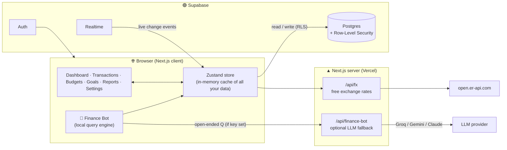
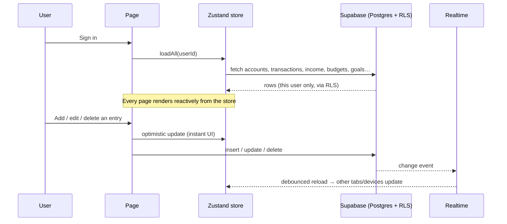
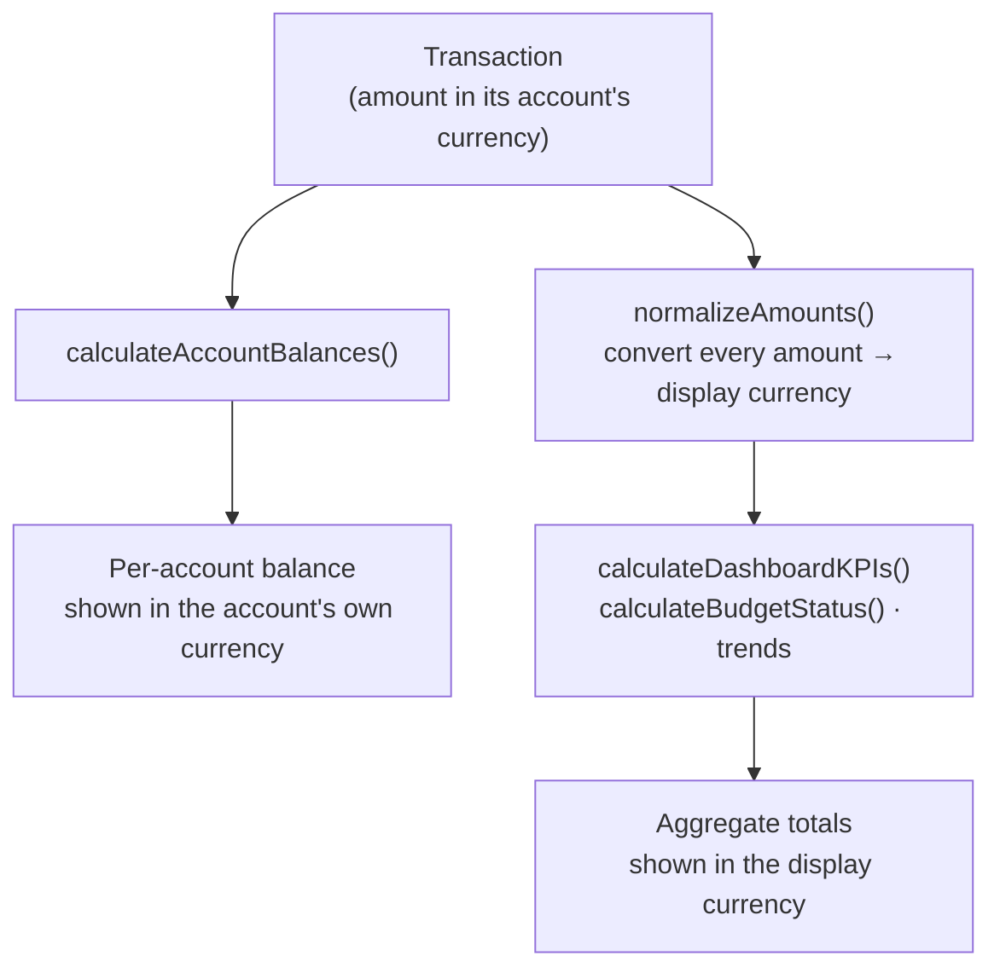
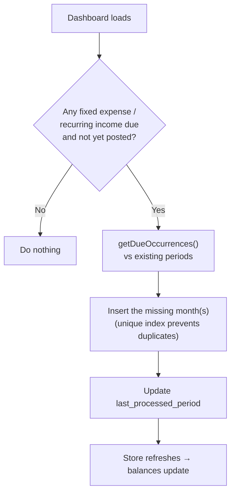
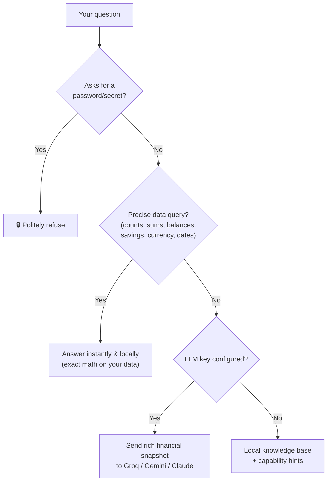

<div align="center">

# 💸 Money Control System

### Your money, fully understood — multi-currency personal finance with an AI assistant.

A production-grade personal finance app for tracking income, expenses, budgets, credit cards, savings goals, and recurring payments — with **proper double‑entry accounting**, **per‑account multi‑currency**, **real‑time sync**, an **AI Finance Bot**, and an installable **PWA**.


</div>

---

## 📑 Table of contents

- [Why this app](#-why-this-app)
- [Feature highlights](#-feature-highlights)
- [Tech stack](#-tech-stack)
- [Architecture](#-architecture)
- [How data flows](#-how-data-flows)
- [Key flows (diagrams)](#-key-flows)
- [Multi-currency, explained](#-multi-currency-explained)
- [The Finance Bot](#-the-finance-bot)
- [Getting started](#-getting-started)
- [Database & migrations](#-database--migrations)
- [Testing](#-testing)
- [Deployment](#-deployment)
- [Project structure](#-project-structure)
- [Scripts](#-scripts)
- [Roadmap](#-roadmap)

---

## ✨ Why this app

Most free trackers just relabel a currency symbol and call it "multi-currency." This one actually **holds each account in its own currency and converts on the fly** — built for someone who earns and spends across countries (e.g. India ↔ Thailand). On top of that it has a genuinely useful **AI assistant** that reads your real numbers, **budget pacing** that warns before you overspend, and **real-time sync** so every tab and device stays in step.

It's a single-user, privacy-first app: your data lives in **your** Supabase project, protected by row-level security, and the AI bot runs **locally** unless you opt into a (free) LLM key.

---

## 🚀 Feature highlights

### 💰 Accounts & transactions
- **Per-account currency** (INR, THB, USD, …) — each account holds its own.
- **7 transaction types** with correct accounting: Expense, Transfer, Saving, Credit-Card Payment, Initial Balance, Initial CC Outstanding, Adjustment.
- **Credit-card logic** done right (outstanding goes up on spend, down on payment).
- **Cross-currency transfers** credit the destination in *its* currency, converted via your rates.
- **Account Statement** — click any account for a running-balance ledger (every entry, oldest→newest, with the balance after it) so you can verify *exactly* how today's number was reached — or flip to **Quick Add** to log an entry to that account.
- **"Balance after" everywhere** — each transaction, income, fixed expense, and recurring-income row shows the affected account's resulting balance, bank-statement style.
- **Powerful Transactions screen:** search · **multi-select** filters (type, category, account, owner — e.g. view expenses *and* savings together) · **flexible date range** (This Month, Last 3 Months, This Year, All Time, custom From→To) · **sortable** columns · **filtered totals** (count + per-type sums + grand total) · **selected-rows sum** · **pagination** (25–All, scales to years of data) · **bulk delete** · **duplicate-detection** warning · **quick-add** floating button.
- **CSV import** wizard: drag-drop → map columns → date-format & signed-amount handling → preview → batched import, with dedup.

### 📈 Insight & planning
- **Dashboard** with a **flexible period selector** (This Month, Last Month, Last 3 Months, This Year, Last Year, or a custom From→To range — view your finances for *any* span), live KPIs (Safe-to-Spend, Spendable, Savings, Investments, CC Outstanding, Net Cashflow, **Savings Rate**), **month-over-month deltas**, a **Net-Worth-over-time** chart, spend-by-category pie, and a 12-month trend.
- **Income** screen with the same flexible date range + **multi-select** filters (category, source, owner) and live totals.
- **Budgets** with **daily pacing** ("allowed till today") and a **projected month-end** forecast.
- **Goals** with priority-based savings-pool allocation and affordability analysis.
- **Reports** — monthly / yearly / custom range, category trends, CSV export.
- **Alerts** — overspend, low/negative safe-to-spend, high CC, due bills — grouped by severity, with **24h snooze**.

### 🔁 Automation
- **Fixed expenses** (rent, EMIs, subscriptions) and **recurring income** (salary, rent received) auto-post each month on their due day — **idempotent** (never duplicates), with back-fill for missed months.
- **Payday sweep** option moves last month's leftover into savings.

### 🌏 Multi-currency
- Free **auto-fetched exchange rates** (no API key) + manual override.
- A **display-currency switch** to view all totals in INR or THB (or anything).
- **Searchable** currency picker; rates list stays clean (only currencies you use).

### 🤖 AI Finance Bot
- Understands natural questions about **your** data: *"how much did I spend last Sunday?"*, *"can I afford a bike for ₹1.5 lakh?"*, *"convert ฿5000 to rupees"*, *"explain my safe-to-spend"*.
- **Free by default** (local engine). Optionally plug a **free Groq or Gemini key** for full open-ended chat.

### 🧰 Platform
- **Real-time sync** across tabs/devices (Supabase Realtime).
- **Global search** across all data (button + `⌘/Ctrl-K`).
- **PWA** — installable, works on mobile.
- **Onboarding wizard**, **session-expiry** handling, **JSON data export**, light/dark themes.
- **Vitest** test suite for the accounting engine (33 tests — balances, budgets, currency conversion, account ledger, running balances, auto-processing).

---

## 🛠 Tech stack

| Layer | Technology |
|---|---|
| Framework | **Next.js 14** (App Router) · **React 18** |
| Language | **TypeScript** (strict) |
| Styling | **Tailwind CSS** + CSS variables (light/dark) |
| State | **Zustand** |
| Backend | **Supabase** — Postgres, Auth, Row-Level Security, Realtime |
| Charts | **Recharts** |
| Dates | **date-fns** |
| CSV | **PapaParse** |
| Icons / UI | **lucide-react**, **Radix UI**, **framer-motion** |
| Notifications | **react-hot-toast** |
| PWA | **next-pwa** |
| Tests | **Vitest** |
| AI (optional) | **Groq** / **Google Gemini** / **Anthropic** via a server route |

---

## 🏗 Architecture



**Principle:** the client loads the user's data once into an in-memory store, renders everything from it (fast, offline-friendly), and writes back to Postgres. Supabase Realtime pushes changes from other devices back into the store. The two server routes are thin, optional helpers (rates + AI).

---

## 🔀 How data flows



1. **Login → `loadAll`** pulls all of *your* rows (RLS guarantees isolation) into the store.
2. **Pages are pure views** of the store — no per-page fetching.
3. **Mutations are optimistic**: the UI updates immediately, then persists to Supabase.
4. **Realtime** keeps every open tab/device in sync (debounced full refresh).

---

## 🧭 Key flows

<details open>
<summary><b>1) A transaction becomes a balance & a KPI (with multi-currency)</b></summary>



*Native per-account amounts stay untouched; only aggregate roll-ups are converted — so totals are correct even across INR + THB accounts.*
</details>

<details>
<summary><b>2) Auto-processing recurring items (idempotent)</b></summary>


</details>

<details>
<summary><b>3) How the Finance Bot answers</b></summary>


</details>

---

## 🌏 Multi-currency, explained

- Your **base currency** = `Settings → Preferences → Base Currency` (e.g. INR). Everything converts *relative to* it.
- Each **account has its own currency**. Balances on account lists show that native currency.
- **Exchange rates** are stored as *"value of 1 unit in the base currency"* (base = 1). Fetch them free with **"Update rates automatically"**, or set them by hand. Only the currencies you actually use are kept.
- A **display-currency switch** (on the dashboard) recomputes all aggregate totals into whatever currency you want to *view* in — without changing stored data.

> Example: base = INR, you have a ฿ (THB) cash account. Spend ฿500 → stored as 500 THB. The dashboard, viewed in INR, shows ≈ ₹1,190; switch the display to THB and it shows ฿500.

---

## 🤖 The Finance Bot

The bot is a floating assistant that **reads your real data**.

**Free, no setup (local engine):** data questions ("how many transactions last week", "biggest expense in June", "balance of all accounts", "my savings"), currency conversion, affordability ("can I afford a car for ₹8 lakh?"), calculation explanations, and app how-tos.

**Optional open-ended chat (bring a free key):** set **one** of these as an environment variable and the bot routes open-ended questions to that LLM with a full snapshot of your finances (tried in this order — free first):

```bash
GROQ_API_KEY=gsk_...        # free tier — console.groq.com   (recommended)
GEMINI_API_KEY=AIza...      # free tier — aistudio.google.com
ANTHROPIC_API_KEY=sk-ant-... # paid — console.anthropic.com
```

No key → it stays fully local and free. It's a *money* assistant — it won't tell you the weather. 🙂

---

## ⚙️ Getting started

### Prerequisites
- Node.js 18+
- A free [Supabase](https://supabase.com) project

### 1. Clone & install
```bash
git clone https://github.com/nitsmee/New-Money-control-system.git
cd New-Money-control-system
npm install
```

### 2. Environment
Copy `.env.local.example` → `.env.local` and fill in:
```bash
NEXT_PUBLIC_SUPABASE_URL=https://your-project.supabase.co
NEXT_PUBLIC_SUPABASE_ANON_KEY=your-anon-key
# Optional AI: GROQ_API_KEY / GEMINI_API_KEY / ANTHROPIC_API_KEY
```

### 3. Database
Run the SQL migrations in order (see below).

### 4. Run
```bash
npm run dev      # http://localhost:3000
```

---

## 🗄 Database & migrations

Apply the files in `supabase/migrations/` **in order** via the Supabase SQL Editor:

| Migration | Adds |
|---|---|
| `001_initial_schema` | Core tables (accounts, transactions, income, budgets, goals, fixed_expenses, categories, owners, user_settings) + RLS |
| `002` / `003` / `004` | Views/functions, settings, category default account |
| `005_recurring_income` | Recurring-income templates |
| `006_income_recurring_fields` | `period`, `recurring_income_id`, `description` on income |
| `007_income_recurring_unique` | Unique index preventing duplicate auto-posted income |
| `008_multi_currency` | `accounts.currency` + `user_settings.exchange_rates` |
| `009_enable_realtime` | Adds tables to the Realtime publication |

> All migrations are idempotent (`IF NOT EXISTS`). Every table is protected by **Row-Level Security** keyed to `auth.uid()`, so users only ever see their own data.

---

## 🧪 Testing

The money-critical engine (`src/lib/utils/calculations.ts`, `autoProcess.ts`) is covered by **Vitest**:

```bash
npm test          # run once  (33 tests)
npm run test:watch
```

Covers currency conversion, account-balance sign conventions, cross-currency transfers, budget pacing, goal analysis, the **account ledger + running balances** (final running balance provably equals the computed balance), leap-year due-date clamping, and auto-process idempotency.

---

## ▲ Deployment

Deployed on **Vercel**:
1. Import the GitHub repo into Vercel.
2. Add the env vars (Supabase keys; optional AI key).
3. Run the SQL migrations against your Supabase project.
4. Push to `main` → Vercel auto-deploys.

---

## 📁 Project structure

```
src/
├─ app/
│  ├─ api/
│  │  ├─ fx/route.ts              # free exchange rates
│  │  └─ finance-bot/route.ts     # optional LLM fallback
│  ├─ auth/                        # login / register / callback
│  └─ dashboard/
│     ├─ page.tsx                  # KPIs, charts, net-worth trend
│     ├─ transactions/             # filters, sort, pagination, sums
│     ├─ income/ · recurring-income/
│     ├─ fixed-expenses/ · budget/ · goals/
│     ├─ reports/ · alerts/ · accounts/ · settings/
│     └─ layout.tsx                # nav, realtime, global search, bot
├─ components/                     # FinanceBot, CurrencySelect, CSVImportModal,
│                                  # GlobalSearch, OnboardingWizard, …
├─ lib/
│  ├─ utils/
│  │  ├─ calculations.ts           # the accounting + currency engine
│  │  ├─ calculations.test.ts      # ✅ unit tests
│  │  ├─ autoProcess.ts            # fixed-expense auto-posting
│  │  ├─ autoProcess.test.ts       # ✅ unit tests
│  │  └─ autoProcessIncome.ts
│  ├─ store/appStore.ts            # Zustand store + loadAll
│  ├─ supabase/                    # client/server helpers
│  └─ useDisplayCurrency.ts        # display-currency hook
├─ types/index.ts                  # all TypeScript models
supabase/migrations/               # 001 → 009 SQL
```

---

## 📜 Scripts

| Command | Does |
|---|---|
| `npm run dev` | Start the dev server |
| `npm run build` | Production build |
| `npm start` | Run the production build |
| `npm run lint` | ESLint |
| `npm run typecheck` | `tsc --noEmit` |
| `npm test` | Run the Vitest suite |

---

## 🗺 Roadmap

- 🧳 **Trip / event grouping** (per-trip totals & currency summary)
- 💱 Cross-currency transfer with an in-form rate field
- 🔔 Push / email bill reminders
- 📊 Cashflow forecast (next 1–3 months)
- 🧾 Receipt attachments · 🏦 debt/loan payoff module
- ⚙️ Server-side pagination · migration runner · split large files

---

<div align="center">

Built with ❤️ for clear, multi-currency money management.

</div>
